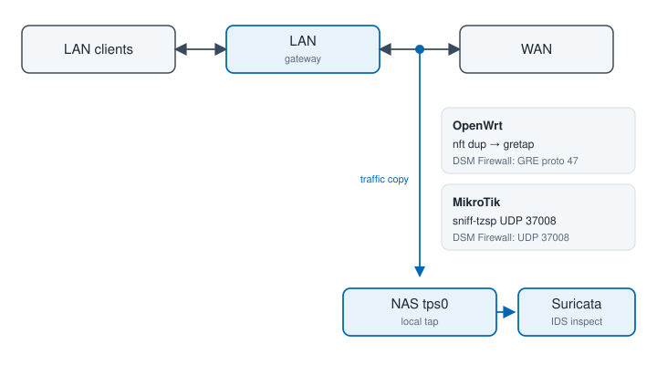

# Threat Prevention for DSM 7

[](https://github.com/T-REX-XP/synology-threat-prevention-x64/actions/workflows/ci.yml)
[](https://github.com/T-REX-XP/synology-threat-prevention-x64/actions/workflows/release.yml)
[](https://github.com/T-REX-XP/synology-threat-prevention-x64/releases/latest)

Community package that runs **Suricata 8** on a **DSM 7 Intel/AMD NAS** and drives the official Threat Prevention desktop app through a compatibility backend.

Research proof of concept — **IDS only** (watch traffic). It does **not** drop packets.


| | |
| --- | --- |
| **Works on** | DSM 7.0+, `x86_64` (Intel/AMD). Not ARM. |
| **Verified on** | SA6400 (`ovs_eth0`). Not tested on a typical stock DiskStation. |
| **Engine** | Suricata **8.0.6** (AF_PACKET + Hyperscan). Version lives in [`VERSION`](VERSION). |
| **Not this package** | IPS / NFQUEUE, DPDK, official `synoips.js` in git or GitHub Releases. |

---

1. [Install on the NAS](#install-on-the-nas)
2. [After install](#after-install)
3. [Copy LAN↔WAN traffic from the router](#copy-lanwan-traffic-from-the-router)
4. [What you get](#what-you-get)
5. [Build from source](#build-from-source)
6. [Repository](#repository)
7. [Documentation](#documentation)
8. [License](#license)

---

## Install on the NAS

You need DSM 7 on Intel/AMD, `curl` / `tar` / `python3` (no Docker, no git), and Package Center set to allow **unsigned** packages.

The installer always takes sources from `main` and the Suricata engine from the latest GitHub Release. It downloads the public SRM UI SPK at pack time, builds the community package, then runs `synopkg install` and `setcap`.

### Option A — Task Scheduler (no SSH)

1. Control Panel → **Task Scheduler** → Create → **Scheduled Task** → **User-defined script**.
2. **User:** `root` (not your DSM login).
3. Uncheck **Enabled** if you only want to run it once.
4. **Task settings → User-defined script** — paste:

```sh
curl -fsSL https://raw.githubusercontent.com/T-REX-XP/synology-threat-prevention-x64/main/install.sh | bash
```

5. Create the task, select it, **Run**. Read the log under **Action → View Result**.

Do not wrap this in `sudo`. The task is already root.

### Option B — SSH

```sh
curl -fsSL https://raw.githubusercontent.com/T-REX-XP/synology-threat-prevention-x64/main/install.sh | sudo bash
```

Pin a specific engine release only if you need to (installer scripts still come from `main`):

```sh
curl -fsSL https://raw.githubusercontent.com/T-REX-XP/synology-threat-prevention-x64/main/install.sh | sudo bash -s -- --tag v0.2.0
```

### Option C — from a git checkout

```sh
sudo ./install.sh
```

| Flag | Meaning |
| --- | --- |
| `--skip-install` | Pack the SPK only |
| `--tag TAG` | Pin the engine GitHub Release (default: latest) |
| `--engine-tar PATH` | Use a local engine tarball |
| `--official-spk PATH` | Use a local official `.spk` |

Unsigned DSM 7 packages cannot ship file capabilities (`synopkg` error 319). **`setcap` is required after every install or upgrade** — `install.sh` does this for you. If you installed the SPK by hand, see [deploy notes](docs/spk-deploy-and-update.md).

---

## After install

Open **Threat Prevention** from Package Center (**Open**) or the Start Menu. Log out of DSM only if the tile is missing or the UI looks stale.

Everything else is in the app:

| | |
| --- | --- |
| **Capture** | Already **`ovs_eth0`** on an SA6400 (the LAN bridge). `eth0` is an OVS slave and is not offered. Change the NIC under Settings → General if you need to. |
| **Current rules** | Settings → **Update** → **Update Now** (ET Open by default). Extra sources: Settings → **Rule Feeds**. First download can take several minutes; the engine reloads when it finishes. |
| **setcap** | `install.sh` already ran it. If Overview shows the capabilities banner, run that command once as admin — unsigned packages cannot apply file caps from the app. |

Manual SPK install, upgrade, and troubleshooting: [docs/spk-deploy-and-update.md](docs/spk-deploy-and-update.md).

---

## Copy LAN↔WAN traffic from the router

The NAS is not the gateway. Capture on `ovs_eth0` only sees packets **to/from this NAS**. To inspect client internet traffic, the LAN gateway sends a **copy** of FORWARD (LAN↔WAN) onto local `tps0`. IDS only — nothing is dropped.



| Gateway | On the router | On the NAS | DSM Firewall (from router LAN IP only) |
| --- | --- | --- | --- |
| **OpenWrt** | `gretap` + nft `dup` on **forward** | Linux `gretap` (`tps0`) | GRE, IP protocol **47** |
| **MikroTik** | mangle `sniff-tzsp` on **forward** | TAP `tps0` + TZSP (UDP **37008**) | UDP **37008** |

Do this only on a trusted LAN. Do not allow GRE or TZSP from the WAN. The SPK never rewrites the router — copy the snippets from the NAS and run them on the gateway.

**Order:** DSM Firewall → router script → Settings → **Receive a traffic copy from the router** → Apply → `synopkg restart` → verify `tps0`.

```sh
# OpenWrt — copy target/etc/openwrt/ to the router first
NAS_IP=192.168.1.130 sh apply-tps-mirror.sh

# MikroTik — edit NasIp / WanIf / LanIf, then:
# /import file-name=apply-tps-mirror.rsc
```

Full steps, MTU notes, disable, and troubleshooting: [docs/router-traffic-copy.md](docs/router-traffic-copy.md).

---

## What you get

Official SRM Threat Prevention is a client for a 21-API `SYNO.TPS.*` stack (aarch64 CGI, PostgreSQL, synosuricata 6 IPS). Those modules do not load on DSM 7 x86_64. This package keeps the official ExtJS window and replaces the engine and backend.

| Layer | Official SRM 1.3.3 | This package |
| --- | --- | --- |
| Target | SRM router (aarch64) | DSM 7 NAS (`x86_64`) |
| Engine | synosuricata 6.0.4 NFQUEUE IPS | Suricata 8.0.6 AF_PACKET IDS |
| Matching | stock AC | Intel Hyperscan (default) |
| Events | PostgreSQL `synotps` | SQLite + `eve.json` ingest |
| WebAPI | `SYNO.TPS.*.so` | Python `tpsweb` |
| Desktop | ExtJS `synoips.js` | Same app + inlined bridge |
| Privilege | root / IPS | package user + admin `setcap` |

**Settings (community):** hardware acceleration (Hyperscan vs portable `ac`/`bmh`), AF_PACKET capture or a router traffic copy onto `tps0`, extra rule feeds from `rule-sources.json`, Telegram alerts, savable default mode. Apply is a server-side compound so capture / accel / schedule land in a defined order.

**Desktop (community):** DSM 7 chart stubs, Devices via `SYNO.Core.Network.NSM.Device`, GeoIP / optional OSM tiles, File Station export share, Update Now polling the real `suricata-update` job.

**Not in this PoC:** inline block / IPS / NFQUEUE, DPDK and NIC offload, PostgreSQL / synotpsd / USB swap, shipping official `synoips.js`.

Official ExtJS (`synoips.js`, texts, help) is **Synology copyright**. It is not in this Git tree and not on GitHub Releases. The installer downloads the public SRM package into `build/official/` (gitignored). Do not publish that tree.

---

## Build from source

For developers and CI. NAS operators should use [install.sh](#install-on-the-nas) instead — that path does not compile.

**Needs:** Linux matching the target (native compile, no Docker), or macOS with Docker (qemu) for `linux/amd64`. GitHub Actions compile natively on `ubuntu-24.04` and `ubuntu-24.04-arm`.

```sh
./build.sh
# artifact/ThreatPrevention-x86_64-<PKG_VERSION>.spk
```

```sh
python3 spk/src/threatprevention/python/test_compat.py
```

| Flag | Meaning |
| --- | --- |
| `--from-release` | Unpack engine from GitHub Releases (no Docker) |
| `--skip-engine` | Reuse `build/suricata-8/out` |
| `--official-spk PATH` | Local official `.spk` instead of downloading |
| `--force` | Re-extract `build/official/` |
| `--skip-tests` | Skip `python/test_compat.py` |

If Synology mirrors are blocked, drop the official SPK at `build/cache/ThreatPrevention-cypress-1.3.3-0926.spk` and re-run.

CI (`.github/workflows/release.yml`) on tag `v*` (for example `v0.1.0`) publishes engine tarballs only — **not** a packed SPK and **not** official ExtJS. Asset names use [`VERSION`](VERSION) `SURICATA_VERSION`; the GitHub tag is `v${PKG_VERSION}`:

```
artifact/suricata-<SURICATA_VERSION>-linux-amd64.tar.gz
artifact/suricata-<SURICATA_VERSION>-linux-arm64.tar.gz
```

`./build.sh` does not decrypt packages or patch Synology binaries. The closed SRM engine is replaced with vanilla Suricata 8.

---

## Repository

```
VERSION                      SURICATA_VERSION (engine). PKG_VERSION comes from git.
install.sh                   NAS: fetch engine, pack SPK, synopkg + setcap
build.sh                     Developer: compile Suricata, then pack
spk/src/threatprevention/    Community package (python, bridge, scripts, yaml)
spk/pack-spk.sh              Assembler
spk/common.sh                Shared download / extract helpers
build/suricata-8/            Docker recipe for Suricata 8
.github/workflows/           CI tests + engine release artifacts
build/cache/                 Downloaded official .spk / engine tar (gitignored)
build/official/              Extracted UI / icons / bootstrap rules (gitignored)
docs/                        Operator + internals
artifact/                    Built community .spk (gitignored)
```

`ui/` is an unused experimental SPA. It is not packed.

Official Synology files never live in git or in GitHub Releases. CI publishes the engine tarball named from [`VERSION`](VERSION). The NAS installer fetches that tarball plus the public `ThreatPrevention-cypress-1.3.3-0926.spk` and copies only what packing needs (ExtJS, icons, ET bootstrap tarball, `SYNO.TPS.lib`). aarch64 `synosuricata` and `SYNO.TPS.*.so` are discarded.

---

## Documentation

Index: [docs/README.md](docs/README.md).

| Doc | When to read it |
| --- | --- |
| [Deploy / upgrade](docs/spk-deploy-and-update.md) | `setcap`, upgrade, troubleshooting |
| [Router traffic copy](docs/router-traffic-copy.md) | OpenWrt GRE or MikroTik TZSP onto `tps0` |
| [Hardware acceleration](docs/hw-acceleration.md) | Hyperscan |
| [Compatibility layer](docs/backend-replaceability.md) | Why tpsweb exists |
| [Shim review](docs/ootb-ui-compat-review.md) | What the bridge patches |

On an installed NAS: DSM Help → **This NAS (Suricata IDS)** and **Router traffic copy**.

---

## License

Community-written files in this repository are under the [MIT License](LICENSE).

- **Synology** owns the official ExtJS app, strings, help, and SRM binaries. They are not in this repository and are not attached to GitHub Releases. Do not copy them into a public fork.
- **Suricata** is GPLv2 (built from upstream, not vendored as source here).
- **PyYAML** is MIT; a copy is under `spk/src/threatprevention/vendor/`.
- The Emerging Threats bootstrap tarball used at pack time comes from the official SPK; it is not in git.

See [NOTICE](NOTICE).
