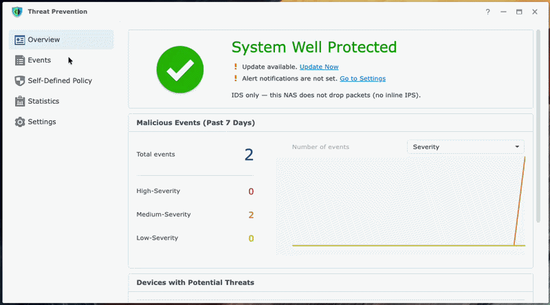

# Threat Prevention (DSM 7 PoC)

[](https://github.com/T-REX-XP/synology-threat-prevention-x64/actions/workflows/ci.yml)
[](https://github.com/T-REX-XP/synology-threat-prevention-x64/actions/workflows/release.yml)
[](https://github.com/T-REX-XP/synology-threat-prevention-x64/releases/latest)

Community **DSM 7 x86_64** package that runs **vanilla Suricata 8.0.6** on a Synology NAS and drives the official Threat Prevention ExtJS app through a compatibility backend.

This is a **research proof of concept**, not a product and not a Synology contribution. It is **IDS only** (AF_PACKET). It does not drop packets (no NFQUEUE / IPS).

**Disclaimer:** this has **not** been tested on a vanilla Synology NAS (stock DiskStation / typical DSM appliance). Runtime work was on an **SA6400** with Open vSwitch (`ovs_eth0`). Capture, NICs, and Package Center behavior will differ on other models.

Current versions are in [`VERSION`](VERSION): **PKG_VERSION** is this SPK; **SURICATA_VERSION** is the upstream engine. They are independent.



## What this is (and is not)

The official SRM app is a client for a 21-API `SYNO.TPS.*` stack (aarch64 CGI modules, PostgreSQL, synosuricata 6 IPS). Those modules will not load on DSM 7 x86_64.

This repo replaces the engine and backend:

| Layer | Official SRM 1.3.3 | This package |
| --- | --- | --- |
| Target | SRM router (aarch64) | DSM 7 NAS (`x86_64`) |
| Engine | synosuricata 6.0.4 NFQUEUE IPS | Suricata 8.0.6 AF_PACKET IDS |
| Signature matching | stock AC | Intel Hyperscan by default |
| Event store | PostgreSQL `synotps` | SQLite + `eve.json` ingest |
| WebAPI | `SYNO.TPS.*.so` | Python `tpsweb` |
| Desktop | ExtJS `synoips.js` | Same app, plus an inlined bridge |
| Privilege | root / IPS | package user + admin `setcap` |

Official ExtJS (`synoips.js`, texts, help) is **Synology copyright**. It is **not** in this Git tree and **not** on GitHub Releases. The NAS installer downloads the public SRM package at pack time into `build/official/` (gitignored). Do not publish that tree.

## Install

On the NAS (DSM 7 Intel/AMD). Package Center → Trust Level: allow unsigned packages.

Always uses the latest installer from `main` and the latest engine GitHub Release.

**Task Scheduler as root** (no SSH). Control Panel → Task Scheduler → Create → Scheduled Task → User-defined script:

1. **User:** `root` (not your DSM login).
2. **Schedule:** uncheck Enabled if you only want to run it once.
3. **Task settings → User-defined script** — paste:

```sh
curl -fsSL https://raw.githubusercontent.com/T-REX-XP/synology-threat-prevention-x64/main/install.sh | bash
```

4. Create, select the task, **Run**. Watch **Action → View Result** for the log.

Already root, so do not wrap the pipe in `sudo`. The installer downloads this repo, the prebuilt Suricata engine from GitHub Releases, the official SRM UI SPK, packs the community package, then `synopkg install` + `setcap`. Log out of DSM and back in afterwards.

**SSH** (same command; `sudo` is required if you are not root):

```sh
curl -fsSL https://raw.githubusercontent.com/T-REX-XP/synology-threat-prevention-x64/main/install.sh | sudo bash
```

`--tag` is optional. Pass it only to pin a specific engine release (`suricata-*-linux-amd64.tar.gz`); installer sources still come from `main`:

```sh
curl -fsSL https://raw.githubusercontent.com/T-REX-XP/synology-threat-prevention-x64/main/install.sh | sudo bash -s -- --tag v0.2.0
```

## Features added vs the official app

These are community additions on top of the official ExtJS window. They are not in SRM Threat Prevention 1.3.3.

**Settings**
- **Hardware acceleration** — Hyperscan vs portable `ac`/`bmh` (end of General). DPDK / NIC offload are notes only, not wired.
- **Capture** — AF_PACKET on the NAS LAN (typically `ovs_eth0`). OVS slaves (`ethN` when `ovs_ethN` exists) are hidden.
- **Rule Feeds** — extra HTTPS sources from a JSON catalog (OISF index), off by default; Apply / Reset like other Settings tabs.
- **Rule source URLs** — ET Open / ET Pro / catalog live in `rule-sources.json` (no hardcoded feed URLs in code).
- **Telegram** — optional bot alerts next to DSM mail / push.
- **Default mode** (availability vs security) is savable; drop-packet / IPS remains off.
- Settings **Apply** uses a server-side compound so capture / accel / schedule land in a defined order.

**Overview / Events / Statistics**
- DSM 7 **chart stubs** (`LineChart` / `PieChart`) — SRM `SYNO.SDS.Chart.*` does not exist on DSM.
- **Devices** list via `SYNO.Core.Network.NSM.Device` (fixes official “No Such API”).
- **GeoIP** on public `ip_src` and optional **OSM tiles** if you do not use Google Maps.
- **File Station** export folder (share path, not `@appdata`).

**Updates**
- **Update Now** polls the real `suricata-update` job (`task_id`), not a HEAD probe.
- Vendored **PyYAML** so `suricata-update` runs on DSM python3.
- Signature schedule weekday as CSV (`0,1,2,3,4,5,6`).

**Ops**
- Community DSM Help: **This NAS (Suricata IDS)** (`setcap`, LAN capture, Hyperscan).
- After install, the package prints the exact `setcap` command. Overview banners if capture capabilities are missing.

**Not in this PoC (still official-only or unwired)**
- Inline block / IPS / NFQUEUE
- DPDK and NIC flow offload
- PostgreSQL / synotpsd / USB swap
- Shipping or redistributing official `synoips.js`

## Repository layout

```
VERSION                       SURICATA_VERSION (engine) + PKG_VERSION (SPK)
install.sh                    NAS: fetch prebuilt engine, pack SPK, synopkg
build.sh                      Developer: compile Suricata via Docker, then pack
spk/src/threatprevention/      Community package (python, bridge, scripts, yaml)
spk/pack-spk.sh               Assembler
spk/common.sh                 Shared download / extract helpers
build/suricata-8/             Docker recipe for Suricata 8
.github/workflows/           CI tests + engine release artifacts
build/cache/                  Downloaded official .spk / engine tar (gitignored)
build/official/               Extracted UI / icons / bootstrap rules (gitignored)
docs/                         Operator + internals
artifact/                     Built community .spk (gitignored)
```

`ui/` is an unused experimental SPA. It is not packed.

Official Synology files never live in git **or in GitHub Releases**. CI publishes
the engine tarball named from [`VERSION`](VERSION)
(`suricata-<SURICATA_VERSION>-linux-amd64.tar.gz` and `-linux-arm64.tar.gz`). The NAS installer fetches the
tarball for this CPU plus the public `ThreatPrevention-cypress-1.3.3-0926.spk` and copies only
what packing needs (ExtJS, icons, ET bootstrap tarball, `SYNO.TPS.lib`). aarch64
`synosuricata` and `SYNO.TPS.*.so` are discarded.

## Requirements

**NAS install** (`curl | sudo bash` or `./install.sh`)
- DSM **7.0+** Intel/AMD (`arch=x86_64`). Will not run on ARM.
- `curl`, `tar`, `python3` (no Docker, no git)
- Package Center → Trust Level: allow unsigned packages
- A GitHub Release that includes the engine tarball from [`VERSION`](VERSION)

**Developer rebuild (`./build.sh`)**
- On Linux matching the target: native compile (no Docker)
- On macOS: Docker (qemu) for linux/amd64

GitHub Actions compile natively on `ubuntu-24.04` (x86_64) and
`ubuntu-24.04-arm` (aarch64). Docker is not used in CI.

## Install on the NAS (no compile)

See [Install](#install) for Task Scheduler as root, or the `curl | sudo bash` SSH one-liner. From a checkout:

```sh
sudo ./install.sh
```

| Flag | Meaning |
| --- | --- |
| `--skip-install` | Pack only |
| `--tag TAG` | Optional. Pin engine GitHub Release (default: latest) |
| `--engine-tar PATH` | Use a local engine tarball |
| `--official-spk PATH` | Use a local official `.spk` |

Default capture interface on SA6400 is **`ovs_eth0`**. `eth0` is the wrong device.

Unsigned DSM 7 packages cannot declare `run-as: root` or file capabilities
(`synopkg` error 319). **`setcap` is required after every install or upgrade.**

Optional: pull current ET Open (do not convert the 2021 bundled dump):

```sh
sudo /var/packages/ThreatPrevention/scripts/update-rules.sh
sudo synopkg restart ThreatPrevention
```

Feed URLs: `target/etc/rule-sources.json`. Override with `/var/packages/ThreatPrevention/etc/rule-sources.json`.

Full operator notes: [docs/spk-deploy-and-update.md](docs/spk-deploy-and-update.md).

## Build from source (developers / CI)

```sh
./build.sh
# artifact/ThreatPrevention-x86_64-<PKG_VERSION>.spk
```

CI (`.github/workflows/release.yml`) on tag `v*` (e.g. `v0.1.0`) builds engine
tarballs **natively** (no Docker), x86_64 and aarch64. Asset names use
[`VERSION`](VERSION) `SURICATA_VERSION`; the GitHub tag is `v${PKG_VERSION}`:

```
artifact/suricata-<SURICATA_VERSION>-linux-amd64.tar.gz
artifact/suricata-<SURICATA_VERSION>-linux-arm64.tar.gz
```

| Flag | Meaning |
| --- | --- |
| `--from-release` | Unpack engine from GitHub Releases (no Docker) |
| `--skip-engine` | Reuse `build/suricata-8/out` |
| `--official-spk PATH` | Use a local official `.spk` instead of downloading |
| `--force` | Re-extract `build/official/` |
| `--skip-tests` | Skip `python/test_compat.py` |

If the Synology mirrors are blocked, drop the official SPK at
`build/cache/ThreatPrevention-cypress-1.3.3-0926.spk` and re-run.

This script does **not** decrypt packages or patch Synology binaries.
The closed SRM engine is replaced with vanilla Suricata 8.

## Tests

```sh
python3 spk/src/threatprevention/python/test_compat.py
```

## Documentation

See [docs/README.md](docs/README.md).

| Start here | |
| --- | --- |
| [Deploy / upgrade](docs/spk-deploy-and-update.md) | `setcap`, upgrade, troubleshooting |
| [Hardware acceleration](docs/hw-acceleration.md) | Hyperscan |
| [Compatibility layer](docs/backend-replaceability.md) | Why tpsweb exists |
| [Shim review](docs/ootb-ui-compat-review.md) | What the bridge patches |

## License and copyright

Community-written files in this repository are under the [MIT License](LICENSE).

- **Synology** owns the official ExtJS app, strings, help, and SRM binaries. They are not in this repository and are not attached to GitHub Releases. Do not copy them into a public fork.
- **Suricata** is GPLv2 (built from upstream, not vendored as source here).
- **PyYAML** is MIT; a copy is under `spk/src/threatprevention/vendor/`.
- Emerging Threats rule tarball used at pack time comes from the official SPK; we do not ship it in git.

See [NOTICE](NOTICE).
